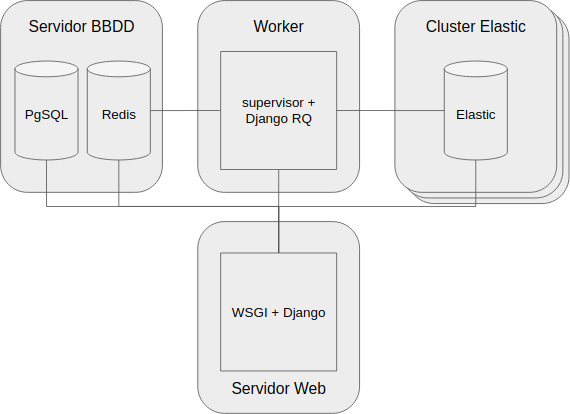

# Arquitectura de la API de series de tiempo

## Introducción

La API de Series de Tiempo del [Paquete de Apertura de Datos de la República Argentina](http://paquete-apertura-datos.readthedocs.io/es/stable/) está basada en una aplicación web [Django](https://www.djangoproject.com) que corre bajo [Python2.7](https://www.python.org/) que funciona como puerta de entrada a los datos que la misma aloja y procesa.

Los datos mencionados previamente son calculados en base a recursos alojados en distintas ubicaciones dentro de la _World Wide Web_, que son obtenidos por procesos asicrónicos basados en [RQ](http://python-rq.org/) orquestados utilizando [supervisor](http://supervisord.org/) y [Redis.io](https://redis.io/).

El almacenamiento de los datos se realiza en un cluster de [Elastic](https://www.elastic.co/) y la API utiliza distintas estrategias para acceder a los mismos, realizando transformaciones precalculadas o en memoria.

## Componentes de la arquitectura

### Servidor Web

El servidor web contiene la aplicación *Django* que conforma el punto de entrada a la API de Series de Tiempo. La aplicación Django es ejecutada utilizando *supervisor* y publicada a la web usando el servidor web [Nginx](https://www.nginx.com/).

Ésta publica un conjunto de endpoints sencillos que permiten acceder a los datos y a los metadatos de la información que contiene, permitiendo configurar filtros y expresiones de transformación predefinidas (ver [documentación de la API de Series de Tiempo](https://series-tiempo-ar-api.readthedocs.io/es/latest/)).

Se trata de una aplicación Django 1.11 (por dependencias transitivas, la API no es compatible con Python3) cuyo panel de administración se utiliza exhaustivamente para configurar el funcionamiento de la misma.

### Cluster de Workers

Los workers están conformados por aplicaciones Python que ejecutan el mismo contexto y _baseline_ de código que la aplicación web. Estos procesos Python realizan distintas tareas asincrónicas de administración que permiten el correcto funcionamiento de la API de Serie de Tiempo, como por ejemplo:

* Procesamiento de archivos de configuración.
* Descarga y validación de los `data.json` de la red de nodos.
* Descarga y validación de los recursos pertenecientes a los datasets seleccionados para indexar.
* Indexación de datos, incluyendo el precálculo de algunos indicadores.
* Indexación de metadatos de los datos.
* Generación de reportes.
* Sincronización de datos con servicios externos.

Las colas de tareas y los workers están basados en Python-RQ, y las tareas se persisten en un servidor de base de datos en memoria Redis.io.

### Servidor de bases de datos

El servidor de bases de datos contiene dos servicios:

* PostgreSQL: Base de datos relacional que contiene el modelo de datos de la aplicación web.
* Redis: Base de datos en memoria que es utilizado para guardar los datos y metadatos de las tareas asincrónicas a ejecutar por los workers y también es utilizado como caché por la aplicación web.

### Cluster Elastic

El cluster Elastic contiene un número de servidores con el servicio de Elastic search ejecutándose. El mismo está configurado para tener 3 _shards_ y una réplica.
