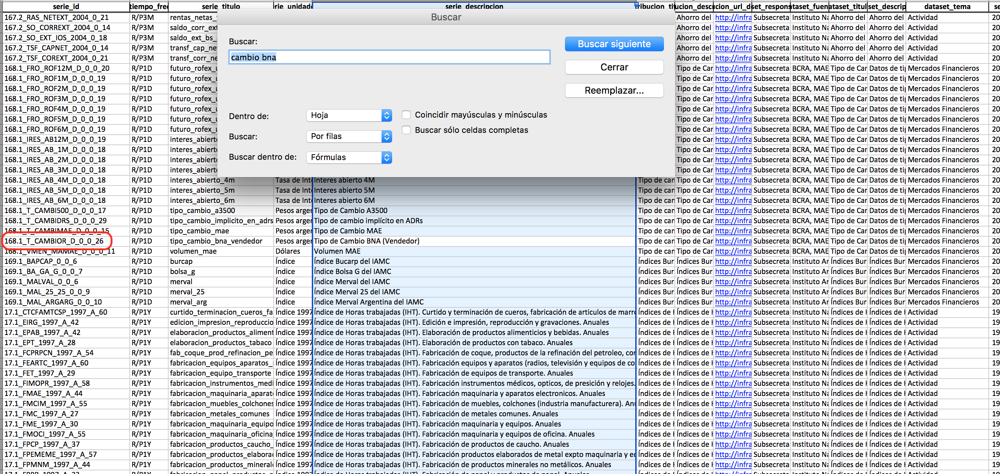
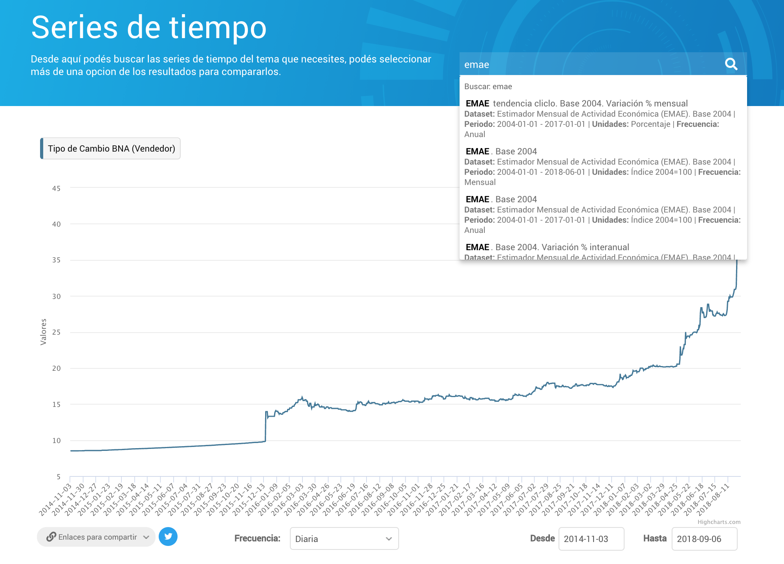
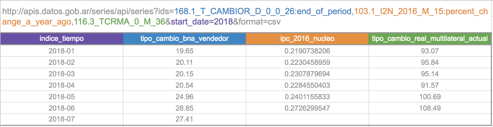
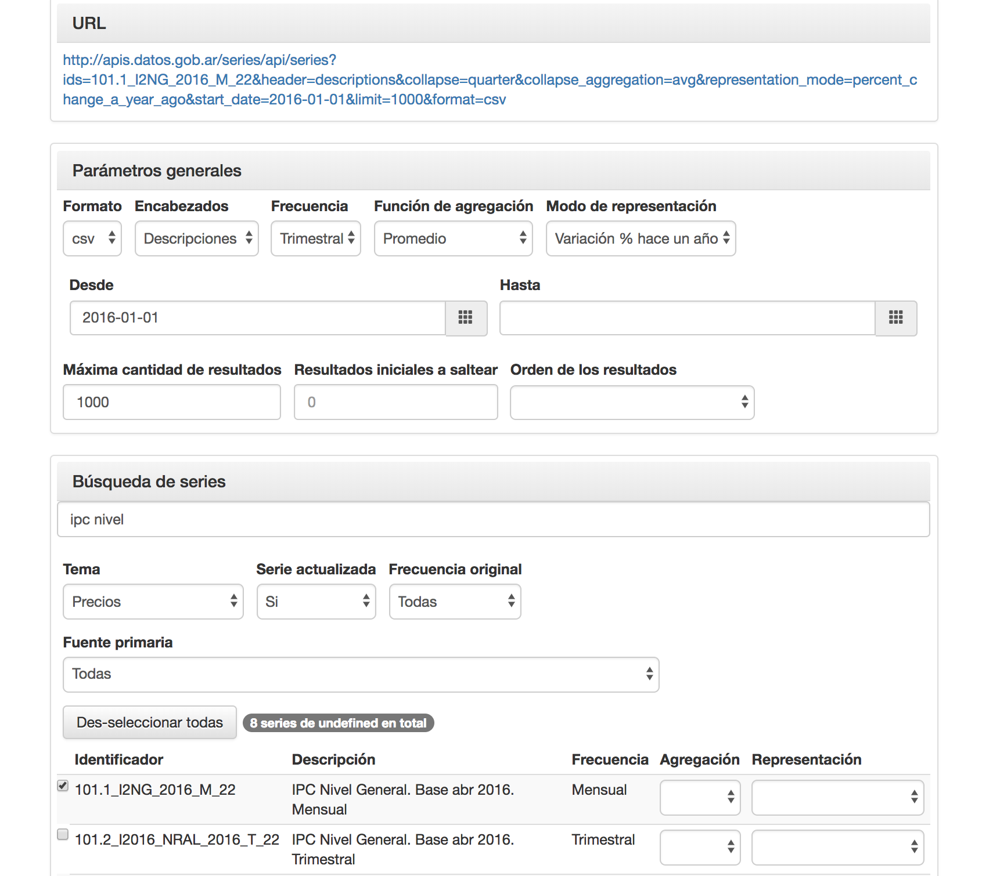

# Start using the Time Series API

<!-- START doctoc generated TOC please keep comment here to allow auto update -->
<!-- DON'T EDIT THIS SECTION, INSTEAD RE-RUN doctoc TO UPDATE -->
 

- [1. Look for series](#1-look-for-series)
  - [In a file](#in-a-file)
  - [In the time series explorer](#in-the-time-series-explorer)
- [2. Build query](#2-build-query)
  - [Manually](#manually)
  - [In the call generator](#in-the-call-generator)
- [3. Make query](#3-make-query)
  - [Use or integrate JSON](#use-or-integrate-json)
  - [Download CSV](#download-csv)
  - [Integrate in a spreadsheet](#integrate-in-a-spreadsheet)
  - [Use in the time series explorer](#use-in-the-time-series-explorer)

<!-- END doctoc generated TOC please keep comment here to allow auto update -->

## 1. Look for series

To use the API, you have to look for series _ids_ of your interest.

### In a file

In[datos.gob.ar](http://datos.gob.ar) you can find the [complete time series database](http://datos.gob.ar/dataset/modernizacion-base-series-tiempo-administracion-publica-nacional), containing the list of available series in different formats:

+ [CSV](http://infra.datos.gob.ar/catalog/modernizacion/dataset/1/distribution/1.2/download/series-tiempo-metadatos.csv)
+ [XLSX](http://infra.datos.gob.ar/catalog/modernizacion/dataset/1/distribution/1.6/download/series-tiempo-metadatos.xlsx)
+ [DTA](http://infra.datos.gob.ar/catalog/modernizacion/dataset/1/distribution/1.10/download/series-tiempo-metadatos.dta)

  

### In the time series explorer

In the [Time Series Explorer](http://datos.gob.ar/series) you can look for series, visualize them and share URLs to the API or the web explorer.

## 2. Build query

### Manually

Series ids must be passed to `ids` parameter. Additional parameter can be used to [filter and transform values](additional_parameters.md).

See the [API reference](reference/api_reference.md) for a complete documentation of all available parameters.

### In the call generator

Using the [call generator](https://datosgobar.github.io/series-tiempo-ar-call-generator) you can see all the available parameters to build an API call.

## 3. Make query

### Use or integrate JSON

For JSON query from the browser or for application integration of the API:

* Use `format=json` (default).
* Choose metadata detail level `metadata=none`, `only`, `simple` o `full`.

[`https://apis.datos.gob.ar/series/api/series?ids=168.1_T_CAMBIOR_D_0_0_26,103.1_I2N_2016_M_15&format=json&metadata=full`](https://apis.datos.gob.ar/series/api/series?ids=168.1_T_CAMBIOR_D_0_0_26,103.1_I2N_2016_M_15&format=json&metadata=full)

### Download CSV

For downloading a CSV file:

* Use `format=csv`.

[`https://apis.datos.gob.ar/series/api/series?ids=168.1_T_CAMBIOR_D_0_0_26,103.1_I2N_2016_M_15&format=csv`](https://apis.datos.gob.ar/series/api/series?ids=168.1_T_CAMBIOR_D_0_0_26,103.1_I2N_2016_M_15)

### Integrate in a spreadsheet

CSV and JSON calls can be [easily integrated in a spreadsheet](spreadsheet_integration.md).

### Use in the time series explorer

Any API call can be visualized from the web explorer taking out the `apis` subdomaing from the URL (and changing to HTTP):

**API call**

[`https://apis.datos.gob.ar/series/api/series?ids=168.1_T_CAMBIOR_D_0_0_26:percent_change_a_year_ago&collapse=month`](https://apis.datos.gob.ar/series/api/series?ids=168.1_T_CAMBIOR_D_0_0_26:percent_change_a_year_ago&collapse=month)

**Web explorer URL**

[`http://datos.gob.ar/series/api/series?ids=168.1_T_CAMBIOR_D_0_0_26:percent_change_a_year_ago&collapse=month`](http://datos.gob.ar/series/api/series?ids=168.1_T_CAMBIOR_D_0_0_26:percent_change_a_year_ago&collapse=month)
